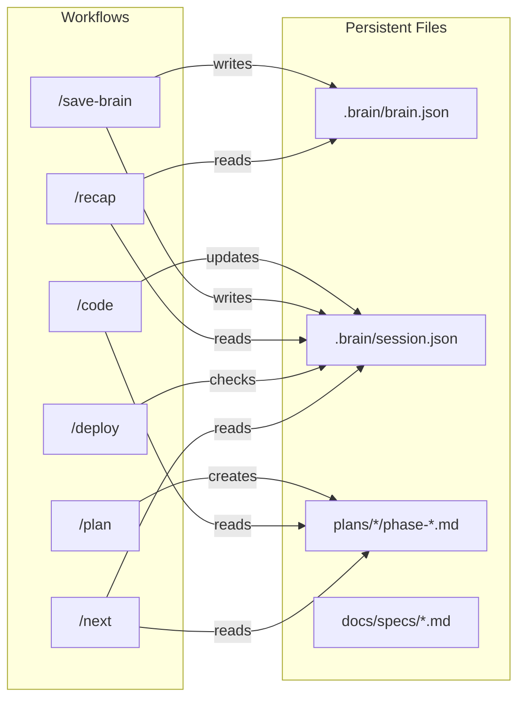

# AWF Workflow Flowchart v3.4

## Main Flow (Beginner Path)

```mermaid
flowchart TD
    subgraph Discovery["Discovery & Start"]
        IDEA[/"Có ý tưởng"/] --> BRAINSTORM[/brainstorm]
        BRAINSTORM --> |BRIEF.md| INIT[/init]
        INIT --> |Project setup| PLAN[/plan]
    end

    subgraph Planning["Planning Phase"]
        PLAN --> |Auto-generate| PHASES[(plans/\nphase-01.md\nphase-02.md\n...)]
        PHASES --> VIZ[/visualize]
        VIZ --> |mockups| CODE
    end

    subgraph Coding["Coding Phase"]
        CODE[/code phase-01] --> |Auto-test| TEST_PASS{Tests?}
        TEST_PASS --> |PASS| NEXT_TASK[Next Task]
        TEST_PASS --> |FAIL 3x| SKIP_OR_FIX{Skip/Fix?}
        SKIP_OR_FIX --> |Fix| DEBUG[/debug]
        DEBUG --> CODE
        SKIP_OR_FIX --> |Skip| BLOCKED[(skipped_tests)]
        NEXT_TASK --> |Phase done| AUTO_SAVE[Auto-save\nsession.json]
        AUTO_SAVE --> NEXT_PHASE{More phases?}
        NEXT_PHASE --> |Yes| CODE
        NEXT_PHASE --> |No| DEPLOY_CHECK
    end

    subgraph Deploy["Deploy Phase"]
        DEPLOY_CHECK{skipped_tests?} --> |Yes| BLOCKED
        BLOCKED --> |Must fix| DEBUG
        DEPLOY_CHECK --> |No| AUDIT[/audit]
        AUDIT --> DEPLOY[/deploy]
        DEPLOY --> LIVE[/"App Live!"/]
    end

    subgraph Memory["Memory & Recovery"]
        SAVE[/save-brain] --> BRAIN[(brain.json\nsession.json)]
        BRAIN --> RECAP[/recap]
        RECAP --> |Resume| CODE
        LIVE --> SAVE
    end

    style BLOCKED fill:#ff6b6b,stroke:#c92a2a
    style LIVE fill:#51cf66,stroke:#2f9e44
    style AUTO_SAVE fill:#ffd43b,stroke:#fab005
```

## Data Flow Between Workflows



## Detailed Workflow Chain

```
┌─────────────────────────────────────────────────────────────────────────────┐
│                           AWF WORKFLOW CHAIN v3.4                           │
├─────────────────────────────────────────────────────────────────────────────┤
│                                                                             │
│  DISCOVERY ──────────────────────────────────────────────────────────────►  │
│                                                                             │
│  ┌──────────┐    ┌──────────┐    ┌──────────┐    ┌──────────┐              │
│  │/brainstorm│───►│  /init   │───►│  /plan   │───►│/visualize│              │
│  │           │    │          │    │          │    │          │              │
│  │ BRIEF.md  │    │ project  │    │ phases/  │    │ mockups  │              │
│  └──────────┘    └──────────┘    └──────────┘    └──────────┘              │
│                                        │                                    │
│                                        ▼                                    │
│  CODING ─────────────────────────────────────────────────────────────────►  │
│                                                                             │
│  ┌─────────────────────────────────────────────────────────────────────┐   │
│  │                         /code LOOP                                   │   │
│  │                                                                      │   │
│  │   ┌─────────────┐    ┌─────────────┐    ┌─────────────┐             │   │
│  │   │ phase-01    │───►│ Auto-Test   │───►│ Auto-Save   │────┐        │   │
│  │   │ phase-02    │    │ (3x retry)  │    │ session.json│    │        │   │
│  │   │ ...         │    └──────┬──────┘    └─────────────┘    │        │   │
│  │   └─────────────┘           │                              │        │   │
│  │                             │ FAIL                         │        │   │
│  │                             ▼                              │        │   │
│  │                    ┌─────────────┐                         │        │   │
│  │                    │Skip? → Block│──────► skipped_tests    │        │   │
│  │                    │Fix?  → Debug│                         │        │   │
│  │                    └─────────────┘                         │        │   │
│  │                                                            │        │   │
│  │   ◄────────────────── Next Phase ─────────────────────────┘        │   │
│  └─────────────────────────────────────────────────────────────────────┘   │
│                                        │                                    │
│                                        ▼                                    │
│  DEPLOY ─────────────────────────────────────────────────────────────────►  │
│                                                                             │
│  ┌──────────┐    ┌──────────┐    ┌──────────┐    ┌──────────┐              │
│  │  Check   │───►│  /audit  │───►│ /deploy  │───►│   LIVE   │              │
│  │ skipped? │    │(optional)│    │          │    │          │              │
│  └────┬─────┘    └──────────┘    └──────────┘    └──────────┘              │
│       │                                                │                    │
│       │ BLOCKED if tests skipped                       │                    │
│       ▼                                                ▼                    │
│  ┌──────────┐                                    ┌──────────┐              │
│  │  /debug  │                                    │/save-brain│              │
│  │  /test   │                                    │          │              │
│  └──────────┘                                    └──────────┘              │
│                                                                             │
│  RECOVERY ───────────────────────────────────────────────────────────────►  │
│                                                                             │
│  ┌──────────┐    ┌──────────┐    ┌──────────┐                              │
│  │  /recap  │───►│  /next   │───►│ Resume   │                              │
│  │          │    │          │    │ /code    │                              │
│  │ brain.json│   │ progress │    │          │                              │
│  │session.json   │ display  │    │          │                              │
│  └──────────┘    └──────────┘    └──────────┘                              │
│                                                                             │
└─────────────────────────────────────────────────────────────────────────────┘
```

## Session.json Data Flow

```
session.json
├── working_on
│   ├── feature ─────────► /recap (hiển thị)
│   ├── task ────────────► /recap, /next (hiển thị)
│   ├── current_plan_path ► /code (đọc phases)
│   ├── current_phase ───► /code, /next (resume)
│   └── status ──────────► /next (progress)
│
├── pending_tasks ───────► /recap, /next (todo list)
│
├── skipped_tests ───────► /recap (reminder)
│   └──────────────────► /deploy (BLOCK!)
│
├── recent_changes ──────► /recap (summary)
│
└── errors_encountered ──► /recap, /debug (context)
```

## Workflow Dependencies

| Workflow | Reads From | Writes To | Blocks If |
|----------|------------|-----------|-----------|
| `/plan` | docs/, brain.json | plans/, session.json | - |
| `/code` | plans/, session.json | *.ts, session.json | - |
| `/test` | src/**/*.test.ts | session.json | - |
| `/deploy` | session.json | - | skipped_tests > 0 |
| `/save-brain` | project files | brain.json, session.json | - |
| `/recap` | brain.json, session.json | - | - |
| `/next` | session.json, plans/ | - | - |

## Quality Level Flow

```
MVP ──────────────────────────────────────────────────►
│
│  /code → syntax check only → /deploy (staging)
│
PRODUCTION ───────────────────────────────────────────►
│
│  /code → auto-test → fix loop → /deploy
│
ENTERPRISE ───────────────────────────────────────────►
│
│  /code → unit + integration + e2e → CI/CD → /deploy
```
